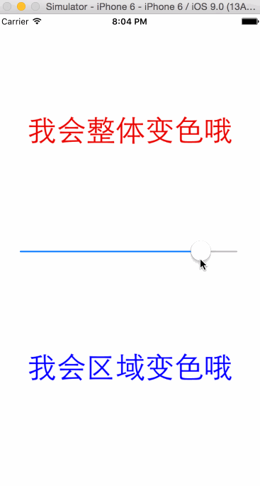

# CATextLayerTest

最近对网易新闻首页顶部标题栏与 UC 浏览器阅读器顶部标题栏的实现效果很好奇，于是尝试实现。字体变色比较好做，CATextLayer 本身就包含了 animated 的 `fontColor`，区域变色就有些麻烦。以前读过王轲的[《基于Core Animation的KTV歌词视图的平滑实现》](http://www.iwangke.me/2014/10/06/how-to-implement-a-core-animation-based-60-fps-ktv-lyrics-view/)，提供一种使用 mask 实现区域变色的思路，很棒，自己按着这个思路尝试使用的时候，发现两个 Label 的字体不能完全重合，总有毛边，一直找不到原因。后来自己想到的一个新的思路，不使用两个 Label，而是将文字作为 mask：先创建一个 CALayer 类型的 baseLayer，背景颜色为白色，再创建一个 CALayer 类型的 subLayer，背景颜色为绿色，subLayer 作为 baseLayer 的子 layer。然后创建 CATextLayer，写上字，将这个 textLayer 作为 baseLayer 的 mask，变化过程中改变 subLayer 的 frame 就可以了。

效果如下：

